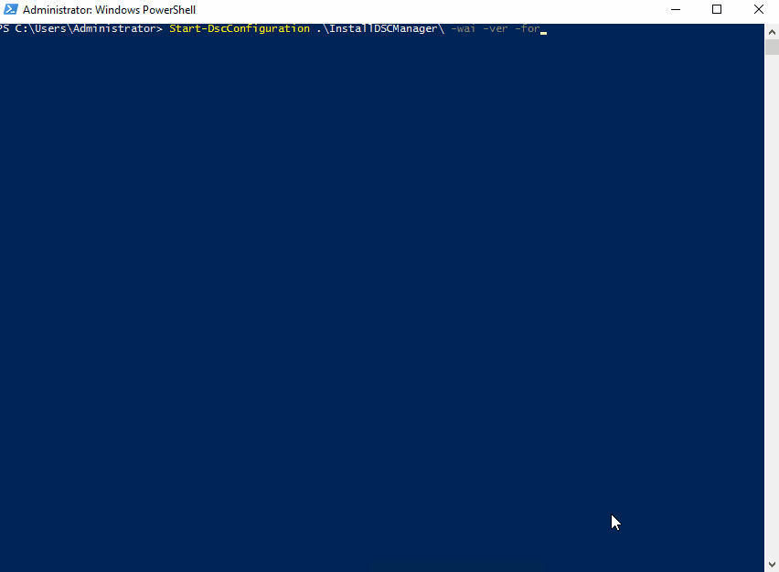

Hey Guys!

Day 12! and another Monday. To get you all rearing for the week, I wanted to have a video ready show casing DSC Manager but I've been really busy lately and haven't managed to get it all together. I'm working on it and it's coming.

However, [@ThomasMaurer](https://twitter.com/ThomasMaurer) recently announced on Twitter the arrival of DSC Manager, writing a brief overview of what it can do. You can find his blog [here](https://www.thomasmaurer.ch/2018/01/announcing-the-itnetx-powershell-dsc-manager/).

What I want to do today is show you how you can get this up and running in a matter of minutes using DSC.

## Getting Up and Running

So, to get you up and running with the least amount of effort, I wrote an example config that will install SQL Express for you directly from Chocolatey. For those of you that don't know what Chocolatey is, it's an online software repository, similar to NuGet. They have both a PowerShell module and DSC Resources to really make it easy to deploy labs etc.

The config could not look much simpler. Install Chocolatey, then SQLExpress, then .Net Core Hosting, then .Net Core Runtime, then Visual C++ Redist., and finally the DSC Manager.

The custom resource goes and installs all the necessary components like IIS, configures authentication and prepares the Database. When the config is finished running you will have a Pull Server rocking and ready to go.

```powershell
Configuration InstallDSCManager {

    Import-DscResource -Module cChoco
    import-dscresource -ModuleName ixdscmanager

    Node $Allnodes.nodename {

        cChocoInstaller InstallChoco {
            InstallDir = "c:\choco"
        }

        cChocoPackageInstaller installSQLExpress {
            Name                 = 'sql-server-express'
            Ensure               = 'Present'
            DependsOn            = '[cChocoInstaller]installChoco'
            PsDscRunAsCredential = $Node.Credential
        }

        cChocoPackageInstaller dotnetserverhosting {
            Name                 = 'dotnetcore-windowshosting'
            Ensure               = 'Present'
            DependsOn            = '[cChocoInstaller]installChoco', '[cChocoPackageInstaller]vcredist2015'
            PsDscRunAsCredential = $Node.Credential
        }

        cChocoPackageInstaller dotnetruntime {
            Name                 = 'dotnetcore-runtime.install'
            Ensure               = 'Present'
            DependsOn            = '[cChocoInstaller]installChoco', '[cChocoPackageInstaller]vcredist2015'
            PsDscRunAsCredential = $Node.Credential
        }

        cChocoPackageInstaller vcredist2015 {
            Name                 = 'vcredist2015'
            Ensure               = 'Present'
            DependsOn            = '[cChocoInstaller]installChoco'
            PsDscRunAsCredential = $Node.Credential
        }

        ixDSCManager PullServer {
            WebsiteName              = "ixDSCManager"
            CertificateThumbPrint    = $Node.Thumbprint
            DatabaseServer           = $Node.SQLServer
            DatabaseName             = $Node.DatabaseName
            FQDN                     = $Node.PullServerFQDN
            UseSecurityBestPractices = $true
        }
    }
}


$config = InstallDSCManager -Configurationdata @{
    allnodes = @(
        @{
            nodename                    = "localhost"
            psdscallowplaintextpassword = $true
            thumbprint                  = "4E727B9209F09D4117B198FE687EAF62D83A5957"
            SQLServer                   = ".\SQLExpress"
            DatabaseName                = "DFTAIPullServer"
            PullServerFQDN              = "pull.dftai.ch"
            Credential                  = new-object pscredential -argumentlist 'administrator', (ConvertTo-SecureString 'Welcome01' -asplaintext -force)
        }
    )
}


Start-DscConfiguration -Path $config.psparentpath -Wait -Verbose -Force
```

Your install should run hopefully without any errors.



> <lazy-load tag="img" :data="{ src: 'http://icons.iconarchive.com/icons/graphicloads/100-flat/256/warning-icon.png', alt: 'info', width:75, style:'float:left; margin: 0 15px 0 0' }" />Right now the media doesn't include the DSC Resource. I'm going to try and get it updated on the server asap. Please be patient, it's coming!

Now all you need is some clients to attach to it. To install the client is even easier.

```powershell
Configuration InstallDSCClient {

    import-dscresource -ModuleName ixdscmanager

    Node $Allnodes.nodename {
        ixDSCClient DSCClient {
            Name = $Node.Nodename
            PullServerAddress = $Node.PullServerAddress
        }
    }
}


$config = InstallDSCClient -Configurationdata @{
    allnodes = @(
        @{
            nodename                    = "Client01"
            PullServerAddress           = "https://pull.dftai.ch:8080"
        }
    )
}


Start-DscConfiguration -Path $config.psparentpath -Wait -Verbose -Force
```

Ok, that's how easy it is to get up and running with DSC Manager in your environments. Head over to [itnetx](http://itnetx.ch/products/dsc-manager/) to download your free 5 client license. There is nothing lose!

Tomorrow we will go over the real benefits of DSC Manager, why you need it and whats coming up for DSC Manager in the future!

Again sorry for the delay everyone but I appreciate your patience.

If you've missed any of the other posts from the 28 Days of DSC series, check them out [here](/posts/?tag=dsc).

If you have any questions or suggestions for topics to cover in the series, hit me up on twitter.

Thanks!

and Don't Forget To Automate It!
