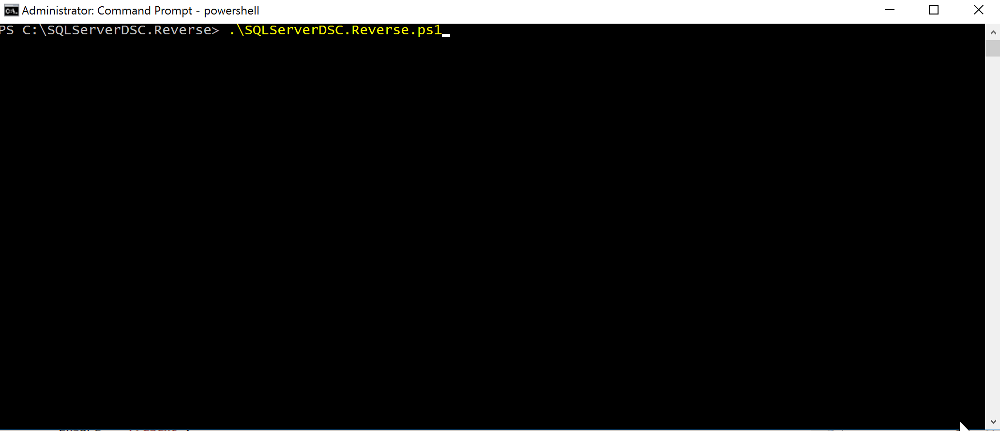

Heys Guys!

Day 24! Getting close to the end now. But don't worry I still have a couple of topics to cover regarding DSC. One that is truly going to blow your mind if you haven't been made aware of it up until now, another #PowerShellHipster thing, Reverse DSC.

The idea as it is implemented today was the brain child of Nik Charlebois. The idea is that you can have a script go and read your environment, and based on that input, generate a DSC configuration.

Today, if you head over to the [Microsoft GitHub](https://github.com/Microsoft/ReverseDSC) page you can see there are currently 5 official Reverse DSC Modules out there.

- [SharePointDSC.Reverse](https://github.com/Microsoft/sharepointDSC.reverse)
- [SQLServerDSC.Reverse](https://github.com/Microsoft/SQLServerDSC.Reverse)
- [PSDesiredStateConfiguration.Reverse](https://github.com/Microsoft/PSDesiredStateConfiguration.Reverse)
- [RemoteDesktopSessionHostDSC.Reverse](https://github.com/Microsoft/RemoteDesktopSessionHostDSC.Reverse)
- [WebAdministrationDSC.Reverse](https://github.com/Microsoft/WebAdministrationDSC.Reverse)

Tomorrow I'm going to go into detail about how it works, and how we can go about creating our own ReverseDSC scripts.

Among other topics, I am planning to present Reverse DSC at both [GeekMania](http://geekmania.ch/2018/) and [ExpertsLive EU](https://www.expertslive.eu/) this year. So if you're interested book tickets and come say yellow. You can tell me how I wasted 28 days of your life 😉.

## Let's Run It

So to see how this works, let's take SQLServerDSC.Reverse and run it against a SQL Express instance I have.

First off you need to have 3 modules installed and ready to use on your machine. They are all available in the PowerShell Module Gallery and can be installed like this.

```powershell
Install-Module ReverseDSC -RequiredVersion 1.9.1.0

Install-Module xSQLServer -RequiredVersion 7.1.0.0

Install-Module SqlServer
```

Yes, the versions are necessary in order to begin to get the current version of SQLServerDSC.Reverse to work.

The SQLServerDSC.Reverse module is currently isn't available via the PowerShell Gallery rather on GitHub, which means you can either download it from the link above or clone it like I showed you yesterday.

Once you have it cloned, you need to update the module reference in the SQLServerDSC.Reverse.ps1 script for xSQLServer to 7.1.0.0 from 8.2.0.0.

Once all this is ready you can run the SQLServerDSC.Reverse.ps1 file.



You tell it where you want to save the configuration and there you have it. A configuration generated entirely based on something I ran in the GUI.

You can copy this between your dev, integration and production environments, updating the names of the servers and you'll have yourselves the beginnings of good a release pipeline.

Alternatively, you could use this to onboard existing machines into DSC. Machines that were configured years ago but you want make sure they stay that way.

If you're feeling extra lazy, you could even use it as a form or documentation. Infrastructure as Code, at least for a DevOps guys perspective is documentation...

So there you are...a quick look into the potential of ReverseDSC.

I admit the example is a bit naf since the SQLServer reverse script is a bit broken. However, I thought it was much less complicated than SharePointDSC.Reverse, which is awesome by the way, and more exciting that PSDesiredStateConfiguration.Reverse which can create Reg Keys and Files.

Anyway, tomorrow promises to be a better day, since when we see something that doesn't work, we take and improve it.

Tomorrows blog is going to consist of a break down of ReverseDSC. How it works, why it doesn't work for the newest version of SqlServerDSC and how we can write our own one from scratch.

In keeping with out current theme, we're heading back to AD but this time to Reverse engineer out AD OU Structure. Useful for people who deploy AD a lot and is hopefully simple enough that you guys can take it and implement for your own purposes.

See you again tomorrow!

If you've missed any of the other posts from the 28 Days of DSC series, check them out [here](/posts/?tag=dsc).

If you have any questions or suggestions for topics to cover in the series, hit me up on twitter.

Thanks!

and Don't Forget To Automate It!
