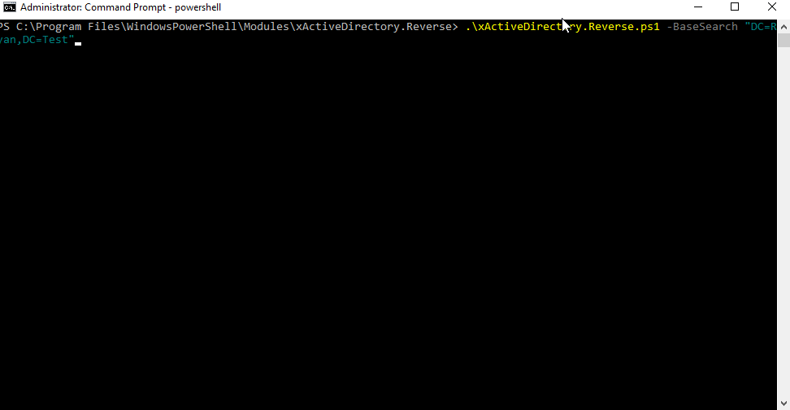

Hey Guys!

Day 26! And today is the day we're going to write our AD Reverse DSC Script.

Over the weekend I covered the bascs of Reverse DSC and what is happening behind the scenes. Unfortunately, I am not happy with where we are at today and so I want to say my 2 pence worth and hopefully prompt all of you guys to help institute the change and really get Reverse DSC up and rolling as a mainstream tool for DSC.

## Scope 🎯

As I mentioned previously, we're going back to our AD example, since I find it's something that lots of people can relate to. What I wanted to demonstrate is how an existing AD OU Structure can be mapped partially or in its entirety using a Reverse Script.

In straight forward terms, what we're looking to do is to automate the data required for xADOrganizationalUnit resource.

I've got a couple of points I want to address from the last post and they as follows:

- Functions within Reverse script should be encapsulated i.e. should have strongly typed inputs and outputs.
- Script should be highly extensible i.e. easy for anyone to add new features i.e. AD Groups etc.
- All data pertaining to configuration should exist in separate ConfigurationData.psd1 file

Not too stringent I feel.

So let's begin.

## Creating xActiveDirectory.Reverse.ps1 📝

Running the following command will create our file and get use going with all the necessary versioning and commentary we need.

```powershell
$RequiredModules = @(
    @{ ModuleName = "ReverseDSC"; ModuleVersion="1.9.2.5" }
    @{ ModuleName = "xActiveDirectory"; ModuleVersion = "2.17.0.0" }
)

New-ScriptFileInfo xActiveDirectory.Reverse.ps1 -Description "ReverseDSC script for xActiveDirectory" -RequiredModules $RequiredModules
```

I also dropped the following script parameters in to get us started.

```powershell
param(
    [parameter(Mandatory)]
    [System.String[]]
    $BaseSearch,

    [parameter()]
    [string]
    $OutputPath
)

$Script:DSCPath = (Get-Module xActiveDirectory -ListAvailable).ModuleBase
$Script:configName = "ADConfiguration"

$Script:DSCModulesImports = @(
    @{
        Name    = "xActiveDirectory"
        Version = "2.17.0.0"
    }
)
```

Implementing these means we can limit out export of Active Directory to a select number of OUs, perhaps OU=Servers,DC=Ryan,DC=Test and OU=Users,DC=Ryan,DC=Test.

I'm also not completely devoid of script variables; here I think they make sense as they are constants.

## Building Functions 🏗️

> <lazy-load tag="img" :data="{ src: 'http://icons.iconarchive.com/icons/graphicloads/100-flat/256/info-icon.png', alt: 'info', width:75, style:'float:left; margin: 0 15px 0 0' }" />I just want to note, I will not be covering all the functions in this post. The entire script can be found on my GitHub in the [Tips and Tricks](https://github.com/rdbartram/PS-Tips-Tricks) repo.

So when we spoke about Orchestrator yesterday, it was the workhorse that had a lot of functionality built it. I've tried as quickly as I can to move out the logic to other functions and keep the orchestrator as clean as possible.

One small change I made was to swap the single large string for an array which I join at the end with r & n aka carriage return.

```powershell
function Orchestrator {
    param (
        [parameter(Mandatory)]
        [System.String[]]
        $BaseSearch
    )

    Import-ReverseDSC

    Write-Information "Configuring Dependencies..."
    $DSCDependentModules = Get-DSCDependentModules

    Write-Information "Scanning [OUs]..."
    $OUs = Read-OUs -BaseSearch $BaseSearch

    Write-Information "Generating OU Configuration Script block..."
    $OUDSCConfig = New-OUDSCConfig

    Write-Information "Configuring Local Configuration Manager (LCM)..."
    $LCMConfig = New-LCMConfig

    $ConfigurationScript = @(New-ConfigurationScriptComments)
    $ConfigurationScript += ""
    $ConfigurationScript += "Configuration $Script:configName {"
    $ConfigurationScript += "param ("
    $ConfigurationScript += "    [PSCredential]"
    $ConfigurationScript += "    `$DomainCredential"
    $ConfigurationScript += ")"
    $ConfigurationScript += ""
    $ConfigurationScript += $DSCDependentModules
    $ConfigurationScript += ""
    $ConfigurationScript += "    Node `$AllNodes.Nodename {"
    $ConfigurationScript += ""
    $ConfigurationScript += $LCMConfig
    $ConfigurationScript += ""
    $ConfigurationScript += $OUDSCConfig
    $ConfigurationScript += "    }"
    $ConfigurationScript += "}"

    Write-Information "Setting Configuration Data..."

    $NonConfigData = @{
        ADConfig = @{
            OUs = $OUs
        }
    }

    $ConfigurationScript += ""
    $ConfigurationScript += "$Script:configName -ConfigurationData `$PSScriptRoot\ConfigurationData.psd1"

    $ConfigData = New-ConfigurationData -NonConfigData $NonConfigData

    $global:test = $ConfigurationScript
    Return [PSCustomObject]@{
        ConfigurationData   = $ConfigData
        ConfigurationScript = $ConfigurationScript -Join "`r`n"
    }
}
```

Whilst looking to fulfil our configuration script simplicity requirement. I wrote a simple function which creates a DSC Block which in turn loops Non-NodeData in order to create the OUs.

The if here is in case you don't want to run this configuration on a DC under local system and you need to have a runas credential.

```powershell
function New-OUDSCConfig {
    $OUDSCConfig = @("        `$ConfigurationData.ADConfig.OUs.Foreach({")
    $OUDSCConfig += "            if(`$DomainCredential) {"
    $OUDSCConfig += "                xADOrganizationalUnit `$_.DSCResourceId {"
    $OUDSCConfig += "                    Name = `$_.Name"
    $OUDSCConfig += "                    Description = `$_.Description"
    $OUDSCConfig += "                    Path = `$_.Path"
    $OUDSCConfig += "                    Ensure = `$_.Ensure"
    $OUDSCConfig += "                    ProtectedFromAccidentalDeletion = `$_.ProtectedFromAccidentalDeletion"
    $OUDSCConfig += "                    Credential = `$DomainCredential"
    $OUDSCConfig += "                }"
    $OUDSCConfig += "            } else {"
    $OUDSCConfig += "                xADOrganizationalUnit `$_.DSCResourceId {"
    $OUDSCConfig += "                    Name = `$_.Name"
    $OUDSCConfig += "                    Description = `$_.Description"
    $OUDSCConfig += "                    Path = `$_.Path"
    $OUDSCConfig += "                    Ensure = `$_.Ensure"
    $OUDSCConfig += "                    ProtectedFromAccidentalDeletion = `$_.ProtectedFromAccidentalDeletion"
    $OUDSCConfig += "                }"
    $OUDSCConfig += "            }"
    $OUDSCConfig += "        })"

    Return $OUDSCConfig
}
```

The Configuration Data I create like this.

```powershell
function Read-OUs {
    param (
        [parameter(Mandatory)]
        [System.String[]]
        $BaseSearch
    )

    $module = Resolve-Path ( join-path $Script:DSCPath "\DSCResources\MSFT_xADOrganizationalUnit\MSFT_xADOrganizationalUnit.psm1")
    Import-Module $module
    $params = Get-DSCFakeParameters -ModulePath $module

    $ADInfo = Read-ADInfo

    $OutputOUs = @()

    #Create OU ConfigurationData
    foreach ($BaseDN in $BaseSearch) {
        $OUs = Get-ADOrganizationalUnit -SearchBase $BaseDN -Filter *
        foreach ($OU in $OUs) {
            $params.Name = $OU.Name
            $params.Path = $OU.DistinguishedName.Replace("OU=$($OU.Name),", "")

            $Results = Get-TargetResource @params

            $Results.Add("DSCResourceId", [Guid]::NewGuid())
            $Results.Add("DistinguishedName", $OU.DistinguishedName)

            $OutputOUs += $Results
        }
    }

    #Set Dependencies
    foreach ($OU in $OutputOUs) {
        $ParentOU = $OutputOUs.where( {$OU.Path -eq $_.DistinguishedName})
        if ($ParentOU) {
            $OU.Add("DependsOn", @("[xADOrganizationalUnit]$($ParentOU.DSCResourceId)"))
        }
    }

    Return $OutputOUs
}
```

And here is the first time I call into the ReverseDSC core functions. Microsoft provides a function called Get-DSCFakeParameters which basically looks at the parameter types and just puts some information in there. For the infos that are actually relevant i.e. the Keys, I set them specifically afterwards.

The logic here is rather simple, we loop through each OU in our BaseSearch and the hashtable that Get-TargetResource returns is exactly the data we need to save into our configuration data (excluding the fact we would need to remove read properties, should they exist).

The only additional infos I add on here are a globally unique resourceid, generated from a guid, and the distinguishedname of the OU. This is so that during my second loop, I am able to correctly build all the dependencies to parent OUs etc.

## Executing 🤸

As I said before, I don't want to include code here, for the sake of code; it's all on GitHub.

Just know I did a little refactoring to make it function a little better. I'm still working to overhaul the project so I can support class based resources, read properties and even abstract 90% of the Reverse script so you really only need write the Get-ADOrganziationalUnit part. The rest should be quite generic.

So once you have all the code loaded on your machine, you can take an environment that looks like this:


do this:



and be sure that no matter what happens, I can rebuild it the way it is right now.

It's like a PowerShell/DSC based backup...🤯.

Now your gears should be really turning...imagine what we could do if we had more of these reverse DSC scripts. Backing up your applications configuration through a desired state configuration.

Troubleshooting a customers environment indirectly by replicating their environment without their data or credentials!

I truly think reverse DSC is an untouched gem of the toolset.

I hope these couple of posts have managed to trigger you to go study and use it in your environments.

Don't forget to come back tomorrow for the penultimate episode of 28 Days of DSC. I'm still not sure if I should do something special like a community Skype call or something for the last day. Just so I can interact with you guys, and you with me.

Let me know on twitter with the hashtag #28DaysOfDSC.

If you've missed any of the other posts from the 28 Days of DSC series, check them out [here](/posts/?tag=dsc).

If you have any questions or suggestions for topics to cover in the series, hit me up on twitter.

Thanks!

and Don't Forget To Automate It!
